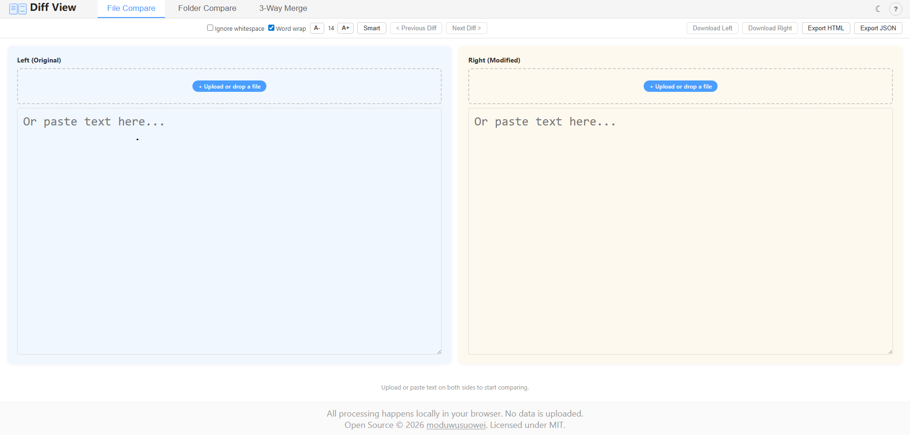

# 【我的开源】手把手教你搭建一个属于自己的代码对比工具 —— DiffView 

你有没有遇到过这样的场景：

- 两个版本的代码文件，想找不同却只能肉眼硬看？
- 在线的 diff 工具怕泄露商业代码，不敢用？
- 想对比两个文件夹的差异，却没有趁手的工具？

今天给大家推荐一个纯前端、本地运行、无需服务器的代码对比工具 —— **DiffView**，并且完全开源！

---

## 一、这是什么工具？

DiffView 是一个运行在浏览器中的文本对比工具。它不需要安装任何后端服务，双击就能运行，所有文件都在你的电脑本地处理，**不会上传任何数据**。

它支持三种工作模式：

### 1. 文件对比模式

上传或粘贴两个文件，左右并排对比，差异一目了然。支持语法高亮、行内编辑、下载结果。

### 2. 文件夹对比模式

选择两个文件夹，自动扫描文件树，按文件名和大小匹配，点击即可查看具体文件的差异。

### 3. 三路合并模式

提供 Base（原始版本）、Left（我们的修改）、Right（他们的修改）三个面板，并排对比，底部输出合并结果。

### 页面详情



---

## 二、为什么要自己做？

市面上的在线 diff 工具很多，但有几个痛点：

| 问题 | 说明 |
|------|------|
| **隐私风险** | 代码上传到第三方服务器，对商业项目不友好 |
| **网络依赖** | 没有网络就没法用 |
| **功能单一** | 只支持文件对比，不支持文件夹和三路合并 |
| **定制困难** | 不能按照自己的需求修改功能 |

DiffView 完全在浏览器本地运行，断网也能用，代码完全开源，你可以随意修改和定制。

---

## 三、核心功能一览

### 编辑器能力
- 基于 Monaco Editor（VS Code 的同款编辑器内核）
- 100+ 语言的语法高亮
- 双栏并排 diff，支持导航差异（上一条/下一条）
- 左右双栏均可编辑，改完可直接下载

### 对比能力
- 文件级对比：拖拽或粘贴文本即可开始
- 文件夹级对比：自动扫描目录树，按文件名和大小匹配
- 三路合并：Base / Ours / Theirs 三栏对比

### 交互体验
- **PWA 支持**：可安装为桌面应用，离线也能用
- **暗色模式**：护眼主题，一键切换
- **字数统计**：显示新增行（+N）、删除行（-N）、修改行（~N）
- **换行开关**：开启/关闭自动换行
- **字体缩放**：A- / A+ 实时调整字号
- **Diff 算法切换**：Smart（精确）和 Legacy（传统）两种模式
- **快捷键面板**：按 `?` 查看所有快捷键

### 导出能力
- **HTML 报告**：带样式的差异表格，可直接分享
- **JSON 报告**：结构化数据，方便程序处理
- **单独下载**：左栏或右栏的内容可独立下载

---

## 四、零基础部署教程

即使你不懂编程，跟着下面的步骤也能把 DiffView 跑起来。

### 准备工作

你需要安装 **Node.js**，它是运行这个项目的基础环境。

**安装 Node.js（5 分钟）**

1. 打开 https://nodejs.org/
2. 下载 LTS 版本（左侧绿色按钮）
3. 双击安装包，一路点「Next」
4. 安装完成后，打开命令行验证：
   ```bash
   node --version
   npm --version
   ```
   如果显示版本号（如 `v22.x.x` 和 `10.x.x`），说明安装成功。

### 方式一：直接下载构建好的文件（最简单）

1. 打开项目的 GitHub Releases 页面
2. 下载最新的 `dist-single.zip`
3. 解压后双击 `index.html`，即可在浏览器中打开使用

这种方式不需要任何安装，下载解压即用，适合只想用工具的同学。

### 方式二：从源码构建

适合想自己修改代码或参与开发的用户。

**第一步：下载源码**

```bash
# 克隆仓库
git clone https://github.com/moduwusuowei/DiffView.git

# 进入目录
cd DiffView
```

如果你没有安装 Git，也可以直接在 GitHub 页面点击「Download ZIP」下载源码压缩包，解压后进入 `DiffView` 目录。

**第二步：安装依赖**

在项目目录下打开命令行，执行：

```bash
npm install
```

这一步会安装项目所需的所有依赖包，大概需要 1-2 分钟。

**第三步：启动开发服务器**

```bash
npm run dev
```

看到终端显示 `Local: http://localhost:5173` 后，在浏览器打开这个地址即可使用。

开发模式下修改代码会自动热更新，适合边改边看效果。

**第四步：构建生产版本**

```bash
# 方式 A：多文件版本（适合部署到服务器）
npm run build

# 方式 B：单文件版本（双击即可打开）
npm run build:single
```

构建完成后：
- `dist/` 目录：多文件版本，需要 HTTP 服务器部署
- `dist-single/` 目录：单文件版本，双击 `index.html` 即可使用

### 方式三：安装为桌面应用（PWA）

构建好的 `dist/` 支持 PWA（渐进式 Web 应用），可以安装到桌面，像原生软件一样使用，还能离线运行。

**操作步骤：**

1. **构建并启动预览服务器**
   ```bash
   npm run build
   npx vite preview
   ```
   终端会显示 `Local: http://localhost:4173`

2. **打开浏览器访问该地址**

3. **安装到桌面**（两种方法均可）
   - 地址栏右侧出现 ⊕ 安装图标，点击 → 弹出确认框 → 点「安装」
   - 或者在地址栏末尾的菜单中，找到「安装 DiffView」

4. **安装完成后**：
   - 桌面出现 DiffView 图标
   - 开始菜单出现 DiffView
   - 双击图标，以独立窗口打开（没有浏览器地址栏和工具栏）
   - **断开网络也能正常使用**，所有资源已缓存到本地
   - 右键图标可以固定到任务栏

> 注意：PWA 安装功能需要 Chrome 或 Edge 浏览器。安装后如果项目有更新，浏览器会自动在后台更新缓存。

**卸载 PWA 的方法：**
- **Chrome**：地址栏输入 `chrome://apps` → 找到 DiffView → 右键 → 删除
- **Edge**：地址栏输入 `edge://apps` → 找到 DiffView → 点击 ⋮ → 卸载
- 或者在 PWA 窗口右上角菜单（⋮）→ 卸载 "DiffView"

### 方式四：部署到服务器

如果你有自己的服务器，可以把 `dist/` 目录部署上去。

**最简单的部署方式 —— 用 Vercel（免费）：**

1. 去 https://vercel.com 注册账号
2. 点击「Add New Project」
3. 导入你的 GitHub 仓库
4. Framework Preset 选择「Vite」
5. 点击「Deploy」，等一分钟就部署好了

**用 Nginx 部署：**

```bash
# 在服务器上
scp -r dist/* /var/www/diffview/

# 配置 nginx
```

---

## 五、技术栈简介

如果你对技术感兴趣，这里列出 DiffView 使用的技术：

| 技术 | 用途 |
|------|------|
| **Vue 3** | 前端框架 |
| **TypeScript** | 类型安全 |
| **Monaco Editor** | VS Code 同款编辑器核心 |
| **Vite** | 构建工具 |
| **Vite Plugin PWA** | PWA 离线支持 |
| **Vitest** | 单元测试 |

---

## 六、开源协议

DiffView 使用 **MIT 协议**，你可以自由使用、修改、商用，甚至闭源分发。

---

## 写在最后

DiffView 诞生于一个简单的想法：做一个不用上传代码、不用联网、功能强大的对比工具。它还很年轻，如果你有好的建议或者发现了 Bug，欢迎在 GitHub 提 Issue。

如果你觉得这个工具有用，欢迎**点赞、在看、转发**三连支持一下～

**项目地址**：

https://github.com/moduwusuowei/DiffView

---

*让代码对比更简单，让数据留在本地。*

*开源 · MIT · 纯前端 · 无需联网*

喜欢就添个star，为我的创作提供更强的动力......