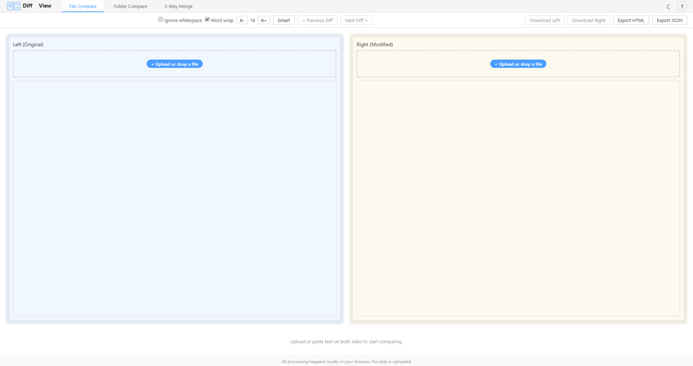

# DiffView

> A browser-based text diff tool powered by Monaco Editor. All processing happens locally — no data uploaded.
>
> 基于 Monaco Editor 的浏览器端文本对比工具，所有处理均在本地完成，无需上传数据。

## Repository

```
https://github.com/moduwusuowei/DiffView
```


## Screenshots / 截图



---

## Features / 功能特性

### Core / 核心功能

| Feature / 功能 | Description / 说明 |
|----------------|-------------------|
| **File Diff / 文件对比** | Upload or paste two files, side-by-side diff with editable panes / 上传或粘贴两个文件，并排对比，支持编辑 |
| **Folder Diff / 文件夹对比** | Compare two directories, click any matched file to view its diff / 选择两个文件夹对比，点击匹配的文件查看差异 |
| **3-Way Merge / 三路合并** | Base / Left / Theirs side-by-side comparison with editable merge result / 原始版本与两侧修改并排对比，编辑合并结果 |
| **Export Report / 导出报告** | HTML (styled diff table) and JSON exports / HTML 带样式差异表格和 JSON 结构化导出 |

### Editor / 编辑器

- 100+ language syntax highlighting via Monaco Editor / 基于 Monaco Editor，支持 100+ 语言语法高亮
- Both panes fully editable, downloadable independently / 左右双栏均可编辑，独立下载
- Previous / Next diff navigation / 上一条 / 下一条差异导航
- Ignore whitespace toggle / 忽略空白字符开关

### UX / 用户体验

- **PWA support / PWA 支持**: Install as a desktop app, works offline / 可安装为桌面应用，离线可用
- **Dark mode / 暗色模式**: Full dark theme with Monaco theme sync / 完整暗色主题，与 Monaco 编辑器联动
- **Diff stats / 差异统计**: Shows `+N` additions, `-N` deletions, `~N` modifications / 显示新增、删除、修改行数
- **Word wrap / 自动换行**: Toggle on/off / 一键切换
- **Font size / 字体缩放**: A- / A+ buttons, range 10-30px / 实时调整字号
- **Diff algorithm / 对比算法**: Smart (`advanced`) or Legacy toggle / 精确模式与兼容模式切换
- **Keyboard shortcuts / 快捷键**: Press `?` to view all shortcuts / 按 `?` 查看全部快捷键

---

## Tech Stack / 技术栈

| Technology / 技术 | Purpose / 用途 |
|------------------|----------------|
| [Vue 3](https://vuejs.org/) | Frontend framework / 前端框架 |
| [TypeScript](https://www.typescriptlang.org/) | Type safety / 类型安全 |
| [Monaco Editor](https://microsoft.github.io/monaco-editor/) | Code editor core (same as VS Code) / 编辑器核心（VS Code 同款） |
| [Vite](https://vitejs.dev/) | Build tool / 构建工具 |
| [vite-plugin-pwa](https://vite-pwa-org.netlify.app/) | PWA / offline support / PWA 离线支持 |
| [Vitest](https://vitest.dev/) | Unit testing / 单元测试 |

---

## Getting Started / 快速开始

### Prerequisites / 前置要求

- **Node.js** ≥ 18 (Download from [nodejs.org](https://nodejs.org/))
- **npm** (comes with Node.js)

Verify installation / 验证安装：

```bash
node --version
npm --version
```

### Install & Run / 安装与运行

```bash
# Clone / 克隆仓库
git clone https://github.com/your-username/DiffView.git
cd DiffView

# Install dependencies / 安装依赖
npm install

# Start dev server / 启动开发服务器
npm run dev
```

Open `http://localhost:5173` in your browser / 在浏览器中打开 `http://localhost:5173`。

### Build / 构建

```bash
# Multi-file build → dist/ (for HTTP server deployment / 用于部署到服务器)
npm run build

# Single-file build → dist-single/index.html (double-click to open / 双击即可打开)
npm run build:single
```

### Preview / 预览生产构建

```bash
npm run preview
```

### Test / 运行测试

```bash
npm test
```

---

## Build Output / 构建产物

| Command / 命令 | Output / 输出 | Usage / 用途 |
|----------------|---------------|-------------|
| `npm run build` | `dist/` (98 files + PWA service worker) | Deploy to Nginx, GitHub Pages, Vercel, etc. / 部署到服务器 |
| `npm run build:single` | `dist-single/index.html` (single 4.5MB file) | Double-click to open locally / 双击本地打开 |

---

## PWA (Install as Desktop App) / 安装为桌面应用

`npm run build` produces a PWA-ready `dist/`. To install it as a desktop app:

1. Build and serve with a local HTTP server / 构建并用本地服务器打开：
   ```bash
   npm run build
   npx vite preview
   ```
2. Open `http://localhost:4173` in Chrome or Edge
3. Click the install icon (⊕) in the address bar, or wait for the install prompt
4. After installation, a standalone window launches. **It works offline.**

**Uninstall / 卸载：**
- Chrome: `chrome://apps` → right-click DiffView → Remove
- Edge: `edge://apps` → click ⋮ on DiffView → Uninstall
- Or in the PWA window menu (⋮) → Uninstall "DiffView"

---

## Deployment / 部署方式

### Option 1: Vercel (Recommended / 推荐)

1. Push your repo to GitHub / 上传仓库到 GitHub
2. Go to [vercel.com](https://vercel.com), import your repo / 导入仓库
3. Framework preset: **Vite**
4. Deploy — done in ~1 minute

### Option 2: Nginx

```bash
npm run build
scp -r dist/* user@server:/var/www/diffview/
```

### Option 3: GitHub Pages

```bash
npm run build
# Push dist/ to gh-pages branch or use GitHub Actions
```

### Option 4: Local / 本地使用

```bash
npm run build:single
# Double-click dist-single/index.html
# 双击 dist-single/index.html 即可使用
```

---

## Keyboard Shortcuts / 快捷键

| Shortcut / 快捷键 | Action / 功能 |
|-------------------|---------------|
| `Ctrl` + `D` | Next diff / 下一条差异 |
| `Ctrl` + `Shift` + `D` | Previous diff / 上一条差异 |
| `Ctrl` + `W` | Toggle word wrap / 切换自动换行 |
| `Ctrl` + `I` | Toggle ignore whitespace / 切换忽略空白 |
| `Ctrl` + `Enter` | Start folder comparison / 开始文件夹对比 |
| `Ctrl` + `L` | Download left file / 下载左栏文件 |
| `Ctrl` + `R` | Download right file / 下载右栏文件 |
| `?` | Toggle shortcuts panel / 切换快捷键面板 |
| `Esc` | Close shortcuts panel / 关闭快捷键面板 |

---

## Browser Support / 浏览器兼容

| Browser / 浏览器 | File Mode / 文件模式 | Folder Mode / 文件夹模式 | Merge Mode / 合并模式 |
|-----------------|---------------------|------------------------|---------------------|
| Chrome / Edge | ✅ | ✅ (via `showDirectoryPicker`) | ✅ |
| Firefox | ✅ | ❌ | ✅ |
| Safari | ✅ | ❌ | ✅ |

> Folder mode uses `showDirectoryPicker` API which is Chrome/Edge only at the moment.
> 文件夹模式依赖 `showDirectoryPicker` API，目前仅 Chrome 和 Edge 支持。

---

## License / 开源协议

[MIT](LICENSE) © 2026


*开源 · MIT · 纯前端 · 无需联网*

喜欢就添个star，为我的创作提供更强的动力......